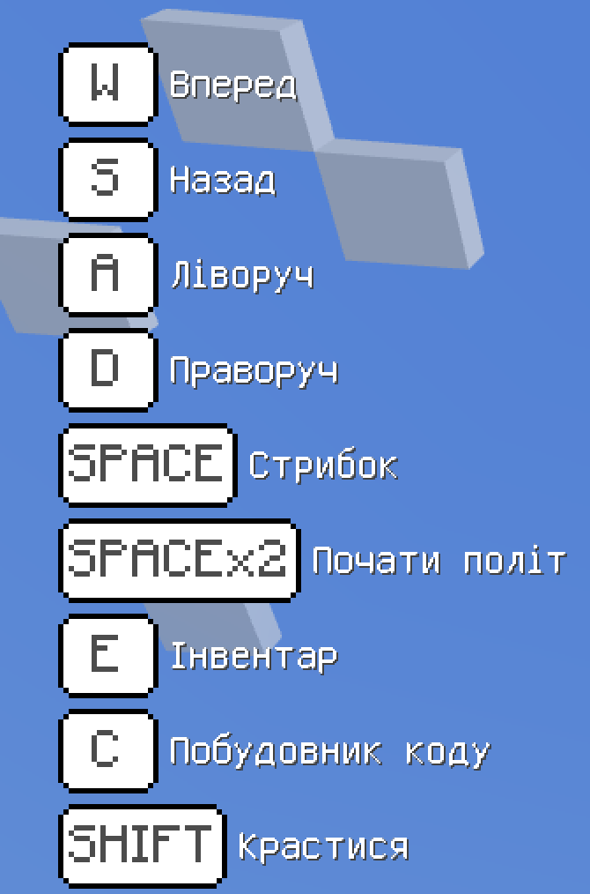
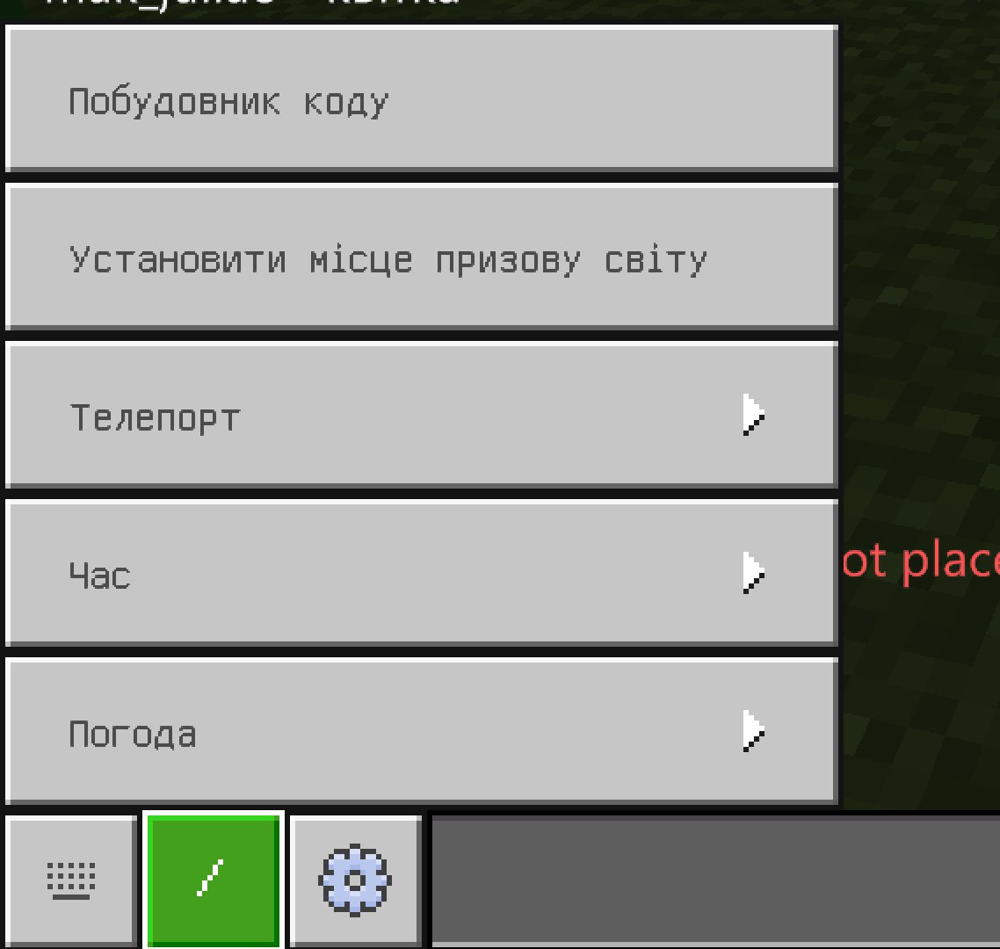
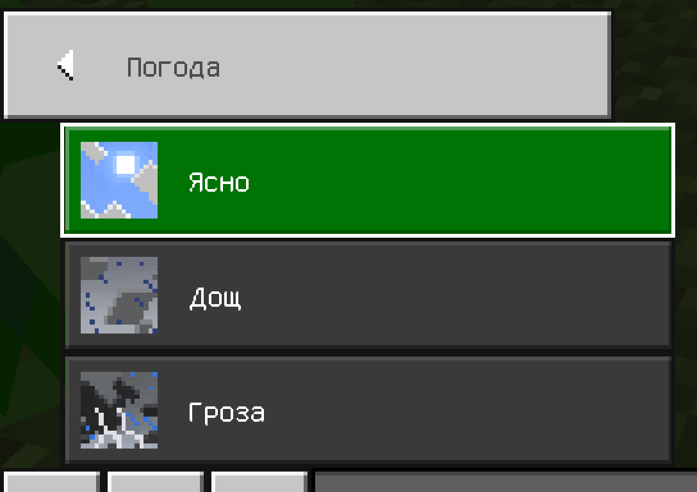

# **Заняття 1.** Знайомство з Minecraft Education

### Створення Світу (заходимо зі своїх акаунтів)

- Які бувають Світи?
- Що зручніше у яких випадках налаштувати?
- Коли ми навчаємось програмувати, тоді які параметри  встановити?

### Управління клавішами

T - чат (дати команду)

E - інвентар

ПКМ - будувати

ЛКМ - руйнувати

### Зміна погоди

**Завдання:** збудувати парк та встановити всередині фонтан
