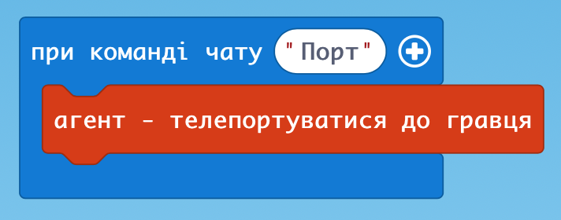
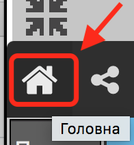
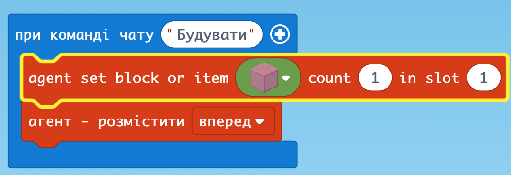

# Заняття 2.  Будуємо споруди

### Виклик Агента та Телепортація

С - виклик коду

Т- чат, де даємо команду

### Створення нового програмного коду

### Кілька умов, щоб Агент будував

1. Телепортувати агента поруч
2. Відійти
3. Перевірити чи є в Агента інвентар (на Агенті натиснути Правою Клавішею Миші)

### Побудова грядок простої форми та саджання

1. Обрати інвентар - "Земля" (або "Рожеве скло")
2. Обрати інвентар рослини - квіти або інші саджанці
3. Обрати місце і натискаючи ПКМ рухатися вперед - буде саджатися

### Кінець заняття: кожен будує будинок “Своєї мрії”

**ДЗ:** побудувати будинок на свій смак 
