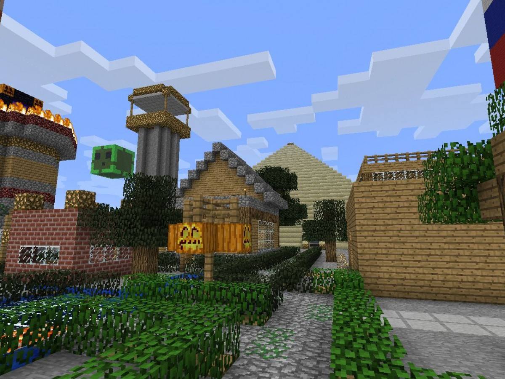

# Заняття 3. Спільна робота

### Проект на спільному світі “Місто моєї мрії”

Як розміститися усім учасникам, щоб усім вистачало місця? (відстань мінімім 20 блоків до сусіда)

Прокласти рівну дорогу між об’єктами

### Об’єкти:
 - житлові будинки
 - пожежна охорона
 - поліція
 - водоканал, каналізація
 - урни для сміття 
 - заводи: для утилізації сміття, виготовлення меблів, предметів зі скла...
 - пекарня, ресторан
 - школа, дит.садок, університет
 - парки, сади, бот.сад
 - магазин
 - ферма зі свіжими овочами
 - пошта (нова пошта)
 - вишка з інтернетом та моб.зв’язком
 - ж\д станція

