# Заняття 4. Програмний код

### Агент

Використовуємо блоки Basic i Гравець

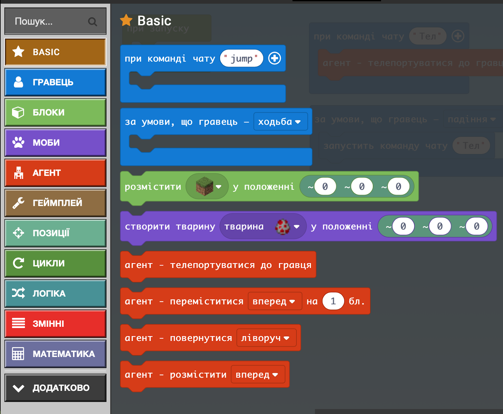

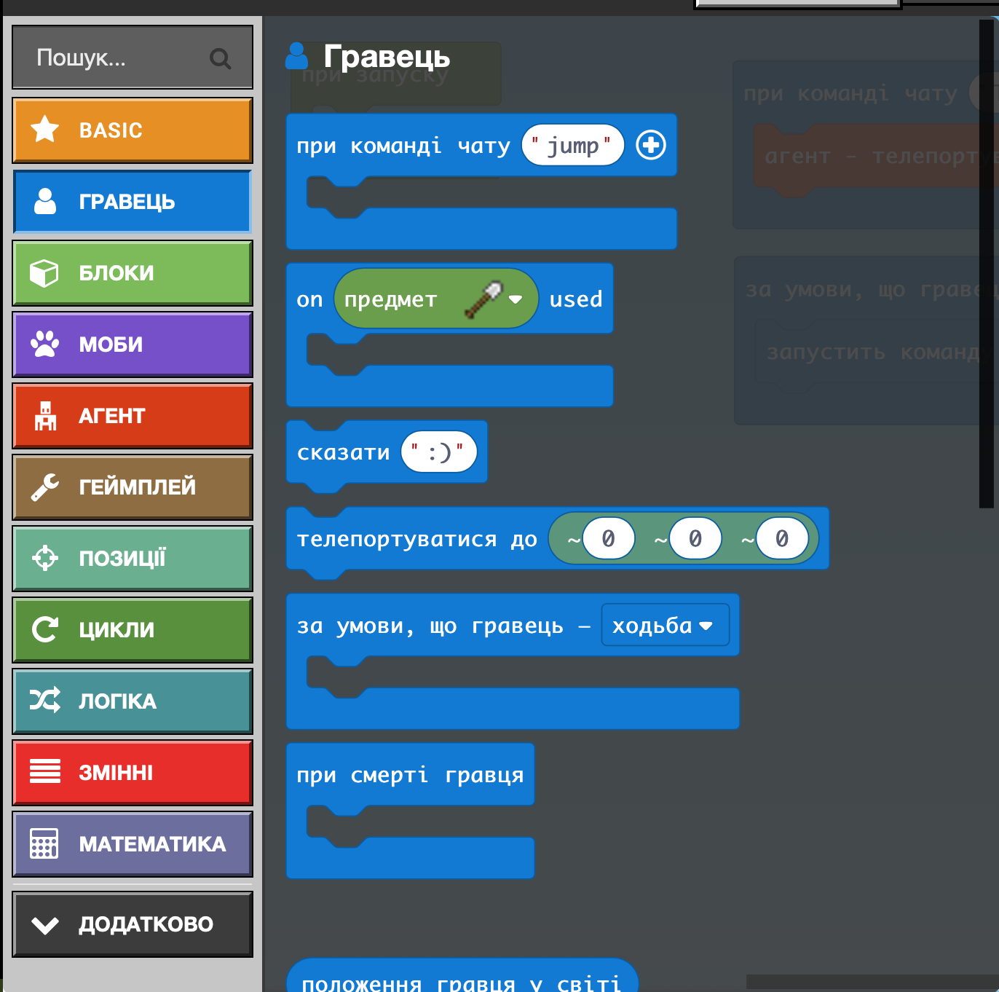

### Агент - ваш помічник і виконує завдання

Він не може садити дерева в повітря чи в тому місці де вже щось чи хтось стоїть

Програма говоритиме про помилки

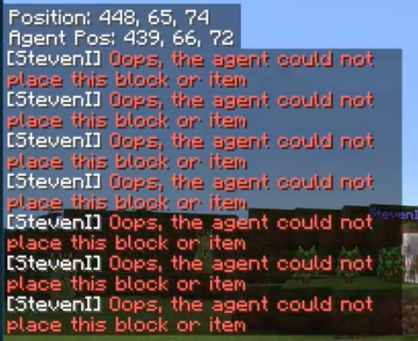

### Агенту команди

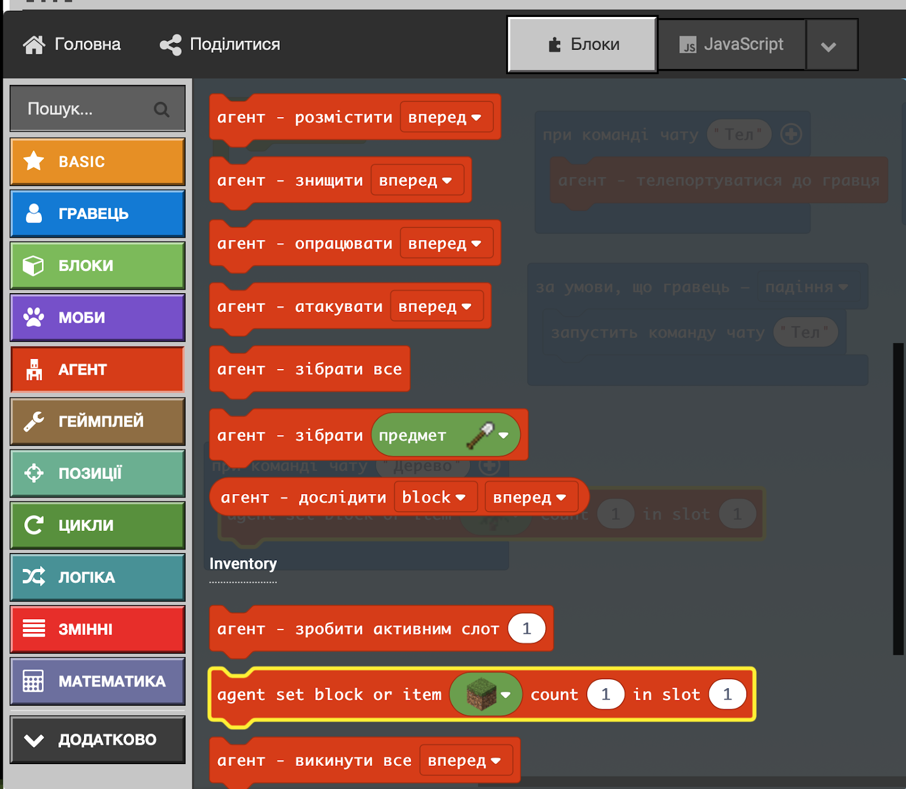

### Додаємо інвентар та саджаємо дерево

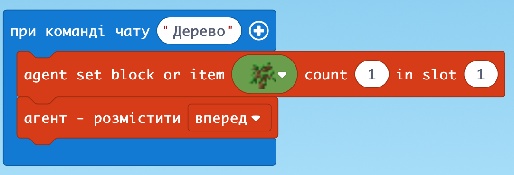

### Більше дерев

### Цілий ряд дерев

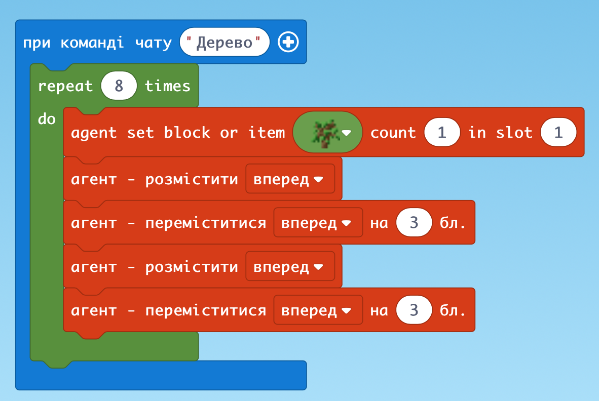

### Два ряди перпендикулярно

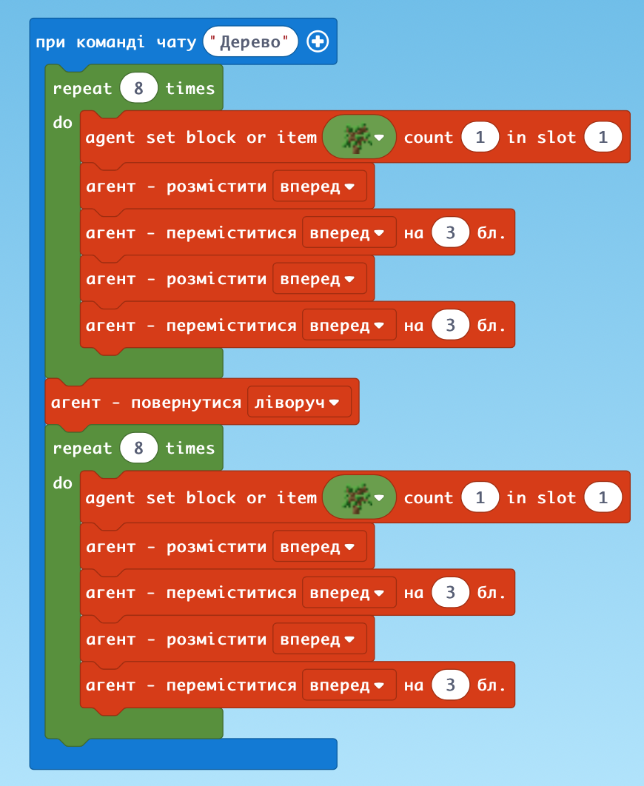

### Дерева по периметру квадрата

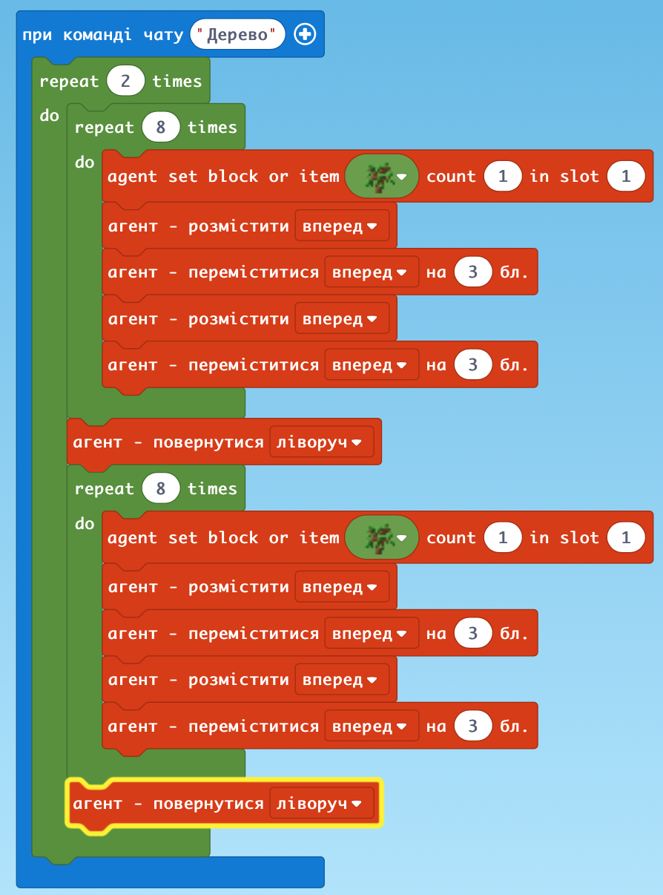

### Коротший

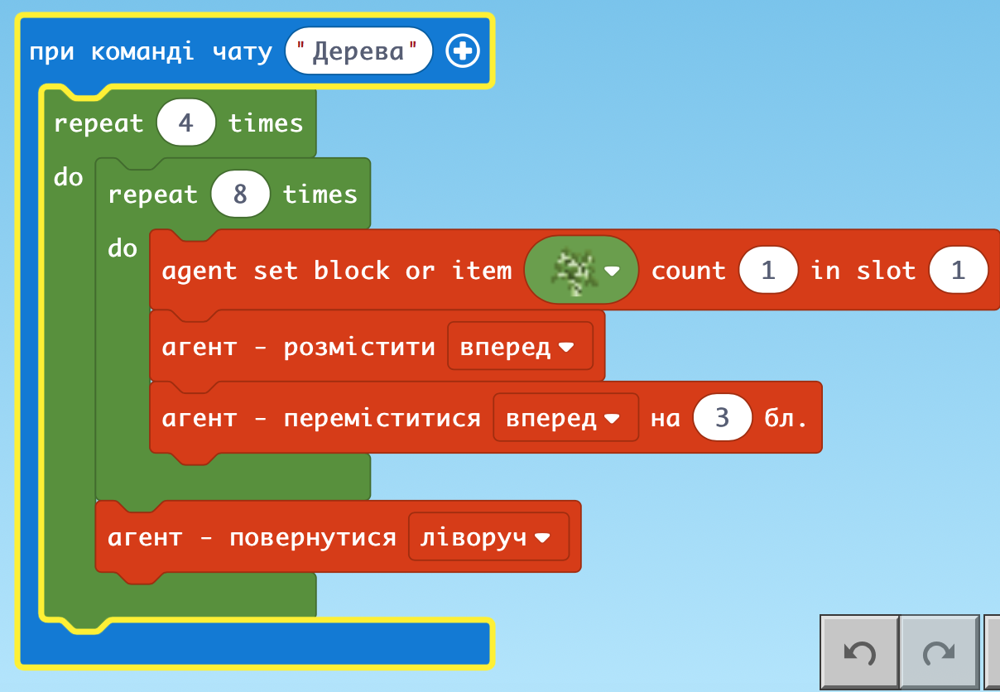

### Заповнюємо

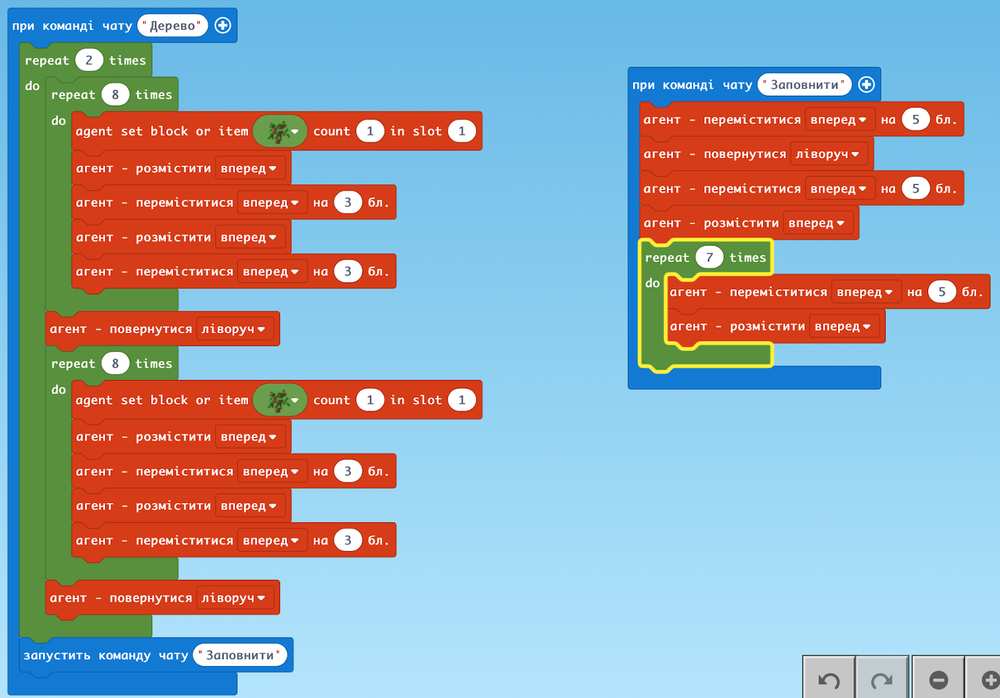

### 2 спосіб: одразу саджаємо по рядам

1 ряд

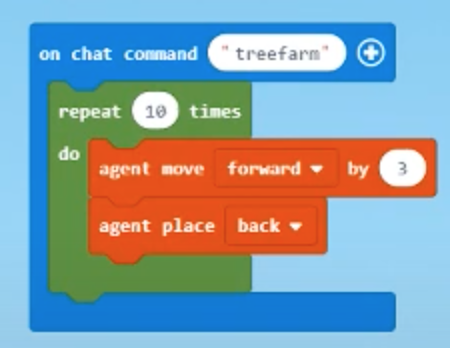

### 2 ряди

Насипати костної муки

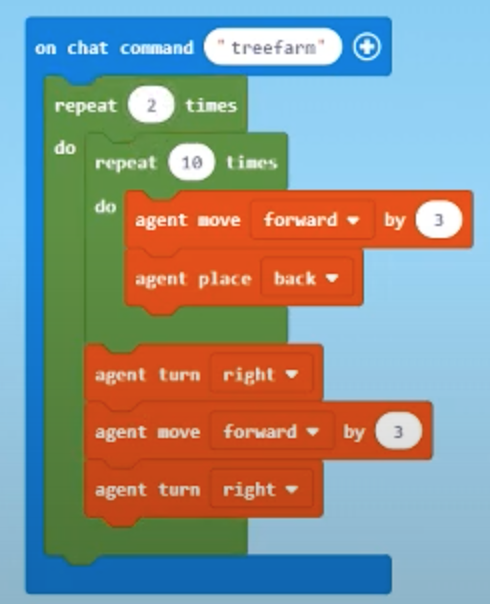

### Агент будує стіну під час руху “На ходу”

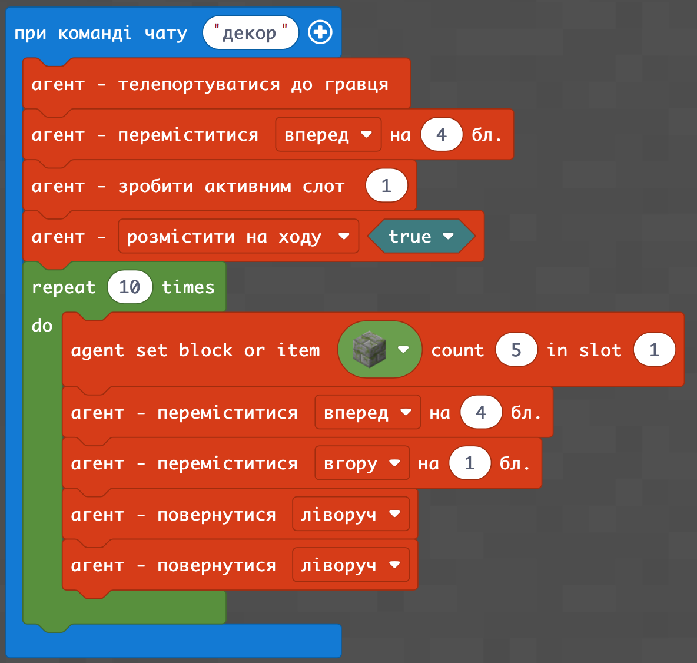

### ДЗ

Ми саджали дерева по периметру квадрата.

Завдання: засадити середину цього квадрату деревами  через код для Агента

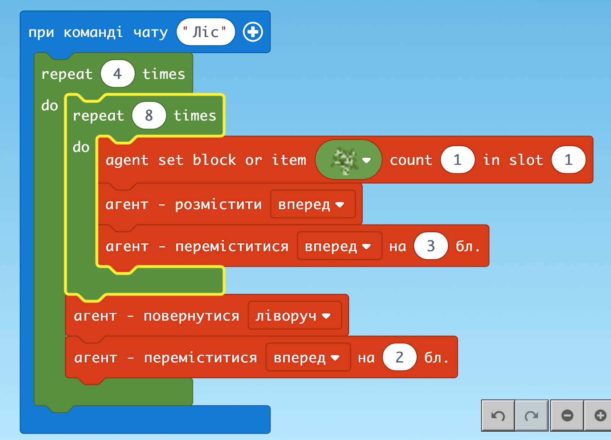
