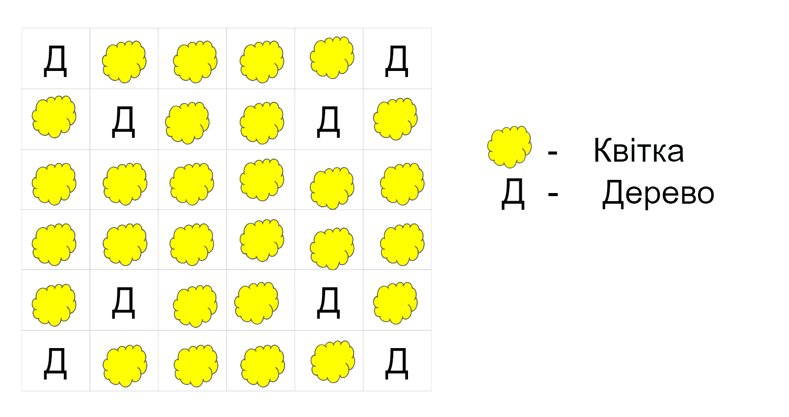

# Заняття 5. Садимо грядки з Агентом

### Завдання: запрограмувати Агента на саджання такого саду:

### Відповідь:

### Завдання: запрограмувати Агента на саджання такого саду:

Та удосконалити попередню програму

### Відповідь: 

### Завдання: запрограмувати Агента на саджання такого саду:

Вдруге удосконалити попередню програму

### Відповідь:

Дописати код

### Обробка поля

Сіємо кавуни

### Додатково: Запрограмувати Агента, щоб він рив ями по квадрату

### Завдання: 

Зробити так, щоб герой розміщував за собою тортики, а агент йшов за героєм і збирав деякі тортики

### Домашнє завдання:

запрограмувати Агента на побудову фонтану

