# Заняття 7. Живі істоти

### Заповнення пустотою

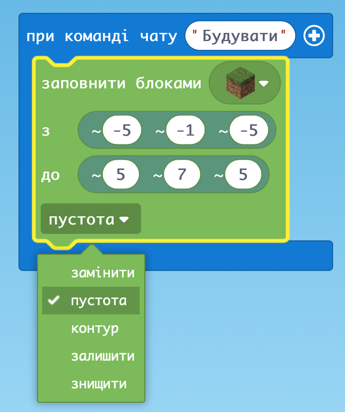

### Побудова приватного будинку

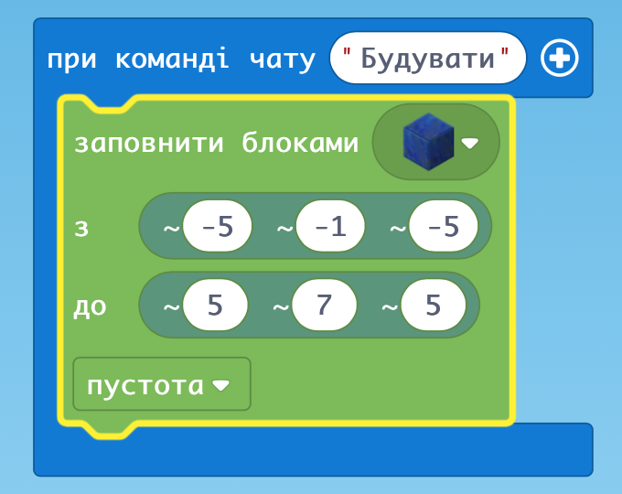

### Добудовуємо вікно

### Два вікна

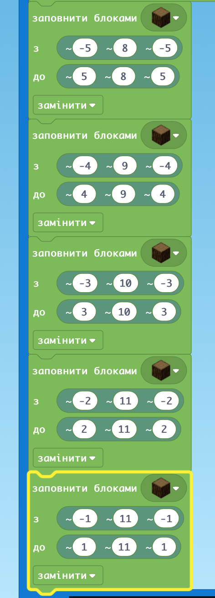

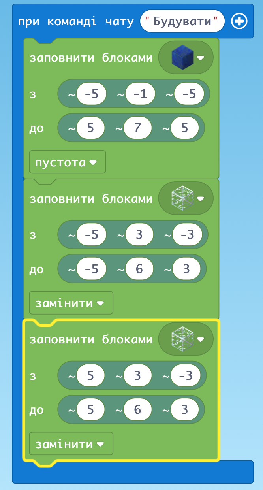

### Двері

по блокам

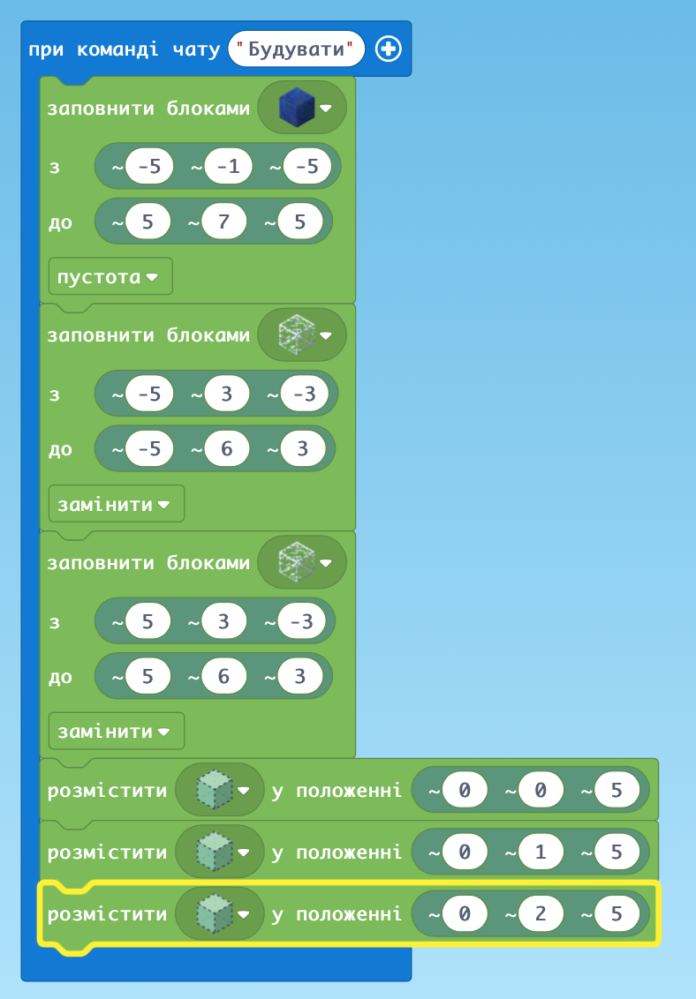

### Ліхтар

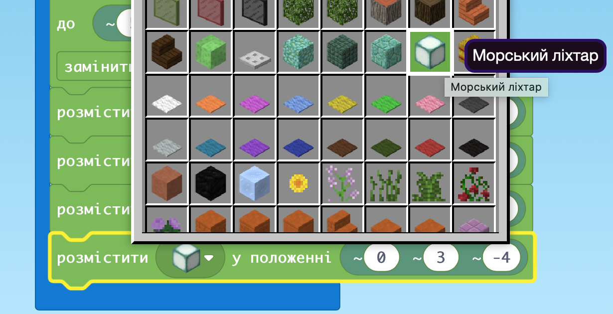

### Табличка біля будинку

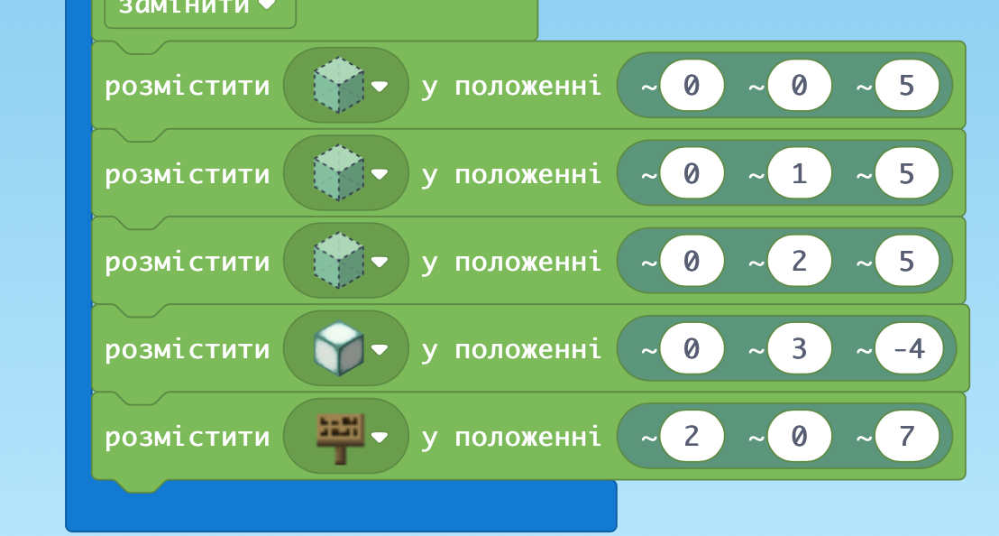

### Темний дах

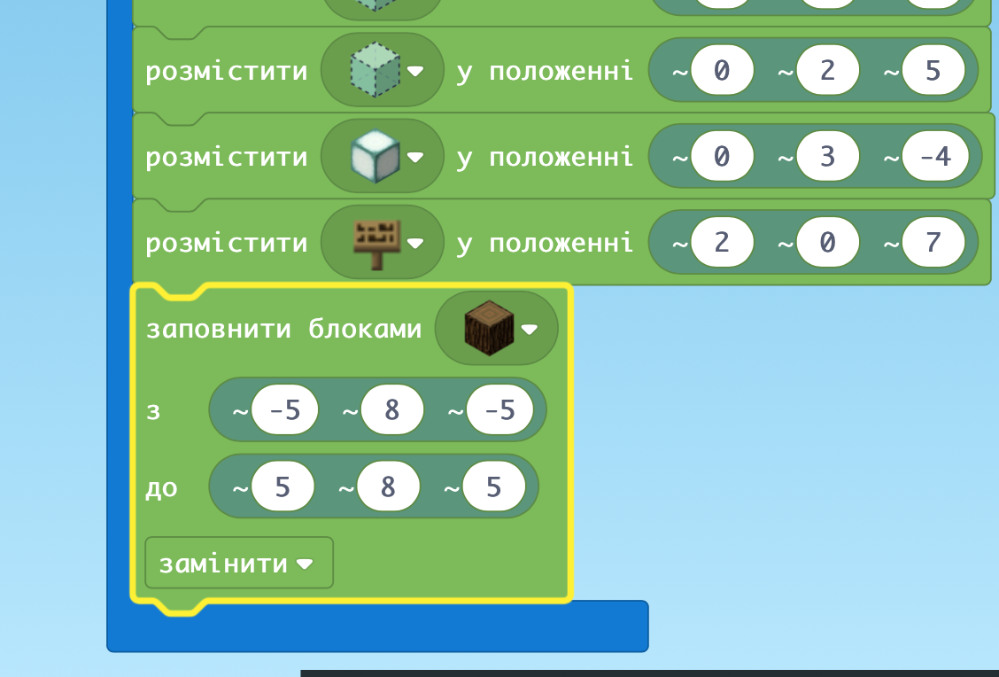

### Красивий дах

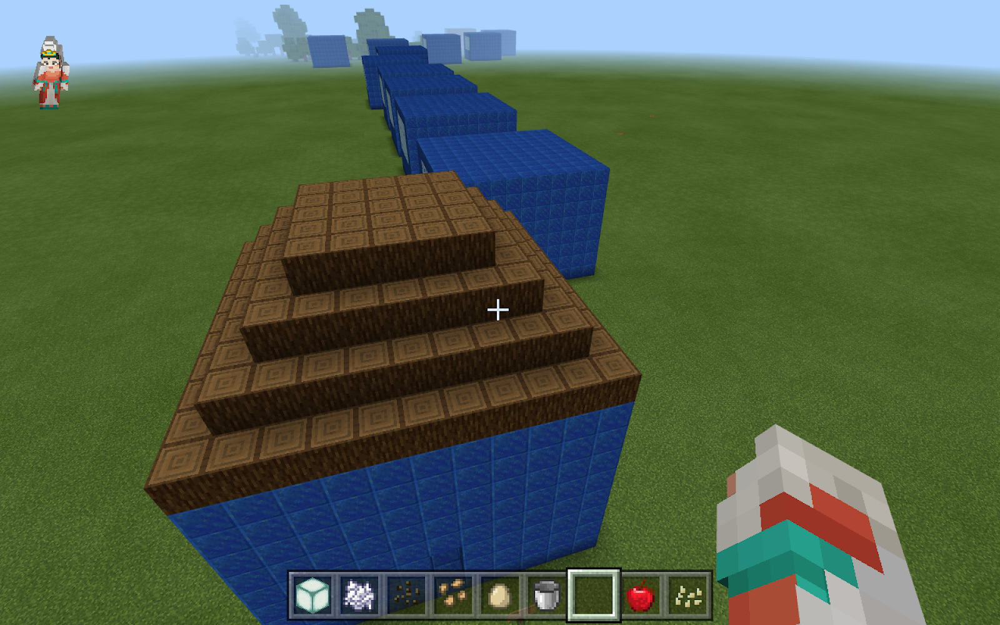

### Дах пірамідкою

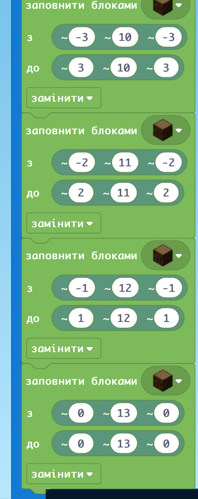

Можна побудувати у повітрі

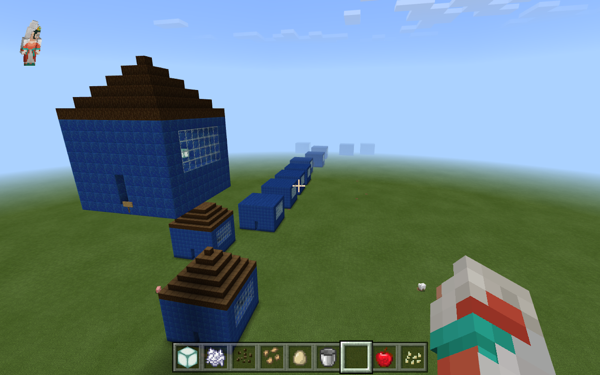

### ДЗ:

“Замуруємо” Агента в будинку

І використання координат Світу

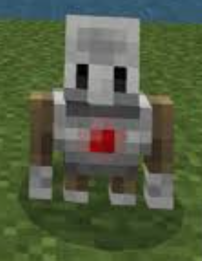
