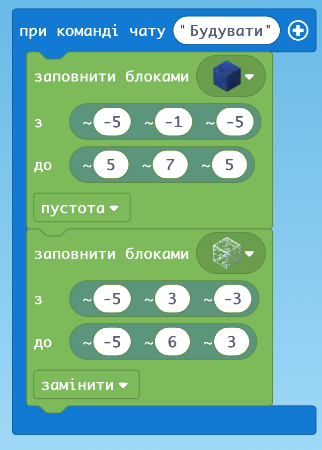
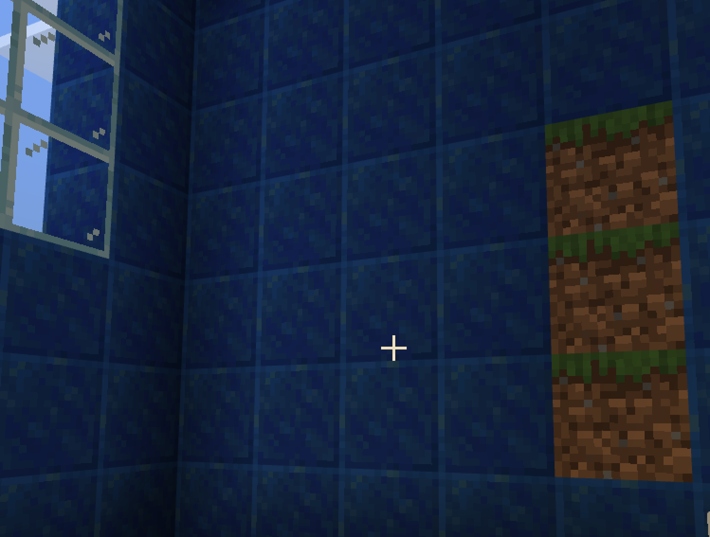

# Заняття 7. Живі істоти

### Заповнення пустотою

### Побудова приватного будинку

### Добудовуємо вікно

### Два вікна

### Двері

по блокам

### Ліхтар

### Табличка біля будинку

### Темний дах

### Красивий дах

### Дах пірамідкою

Можна побудувати у повітрі

### ДЗ:

“Замуруємо” Агента в будинку

І використання координат Світу

