# Заняття 8. Акваріум

### Використання світових координат

УПРАВЛІННЯ Агентом покроково

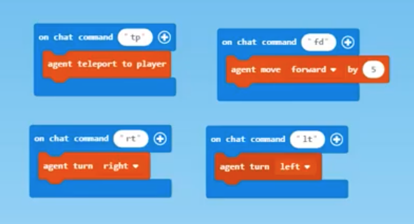

### Малий Куб навколо Героя по координатам

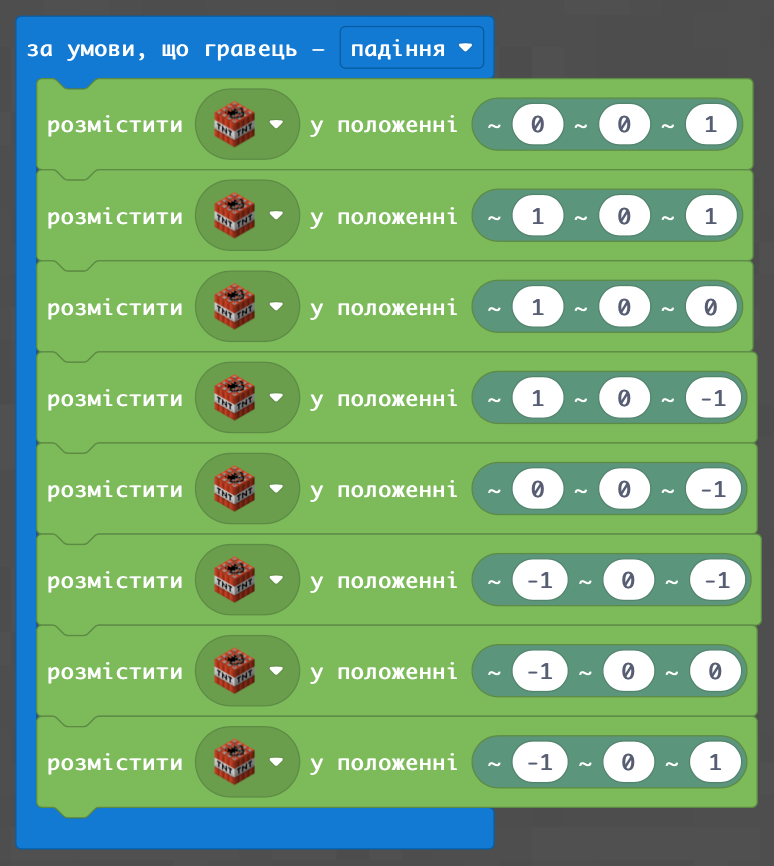

### Малий Куб навколо Героя по координатам у вигляді огорожі

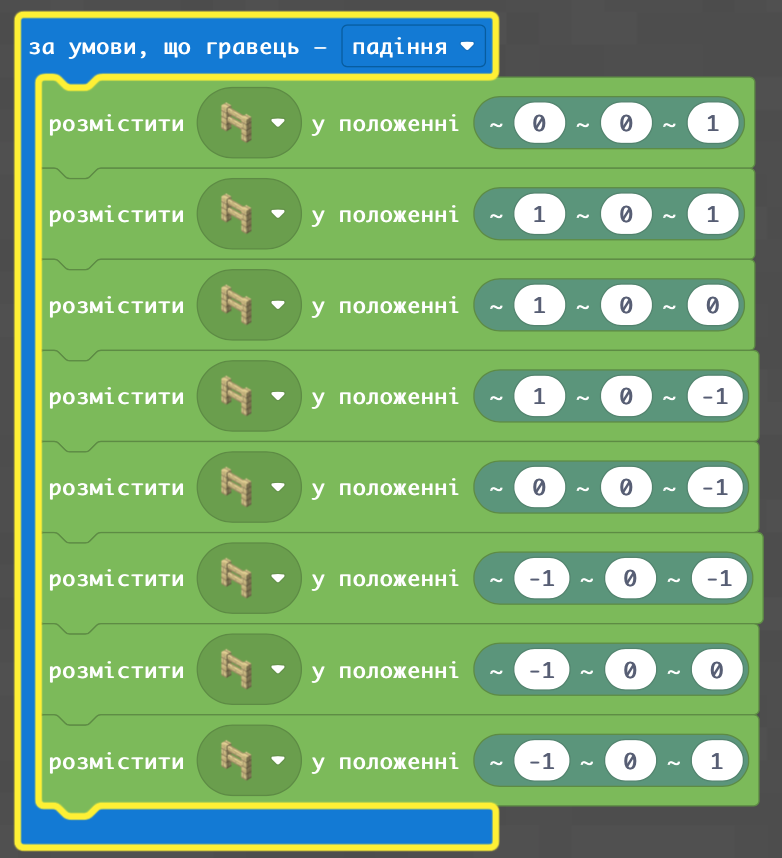

### Великий Куб навколо Героя по координатам

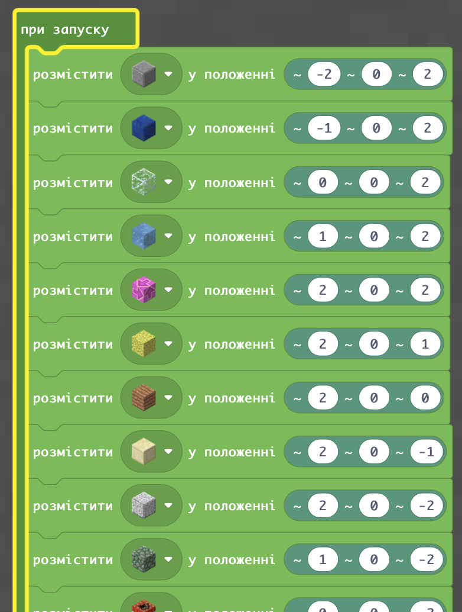

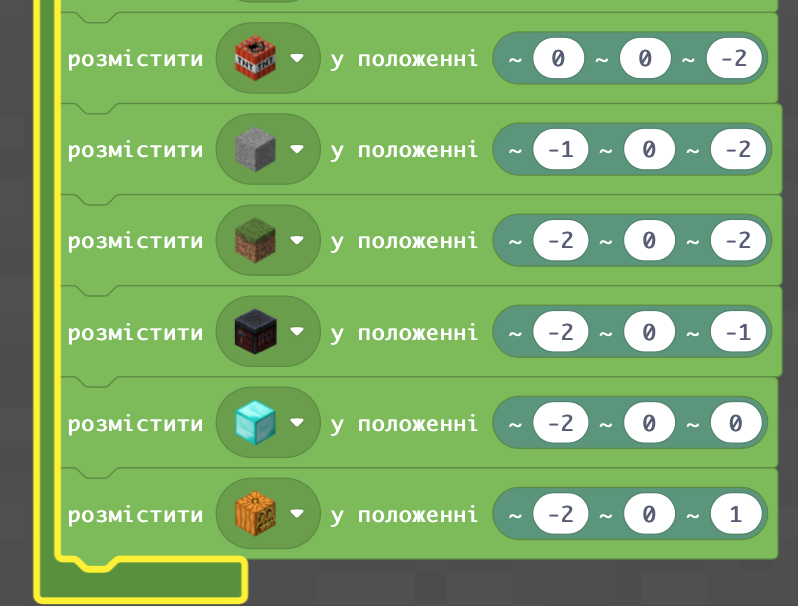

### Створимо будинок без вікон і дверей

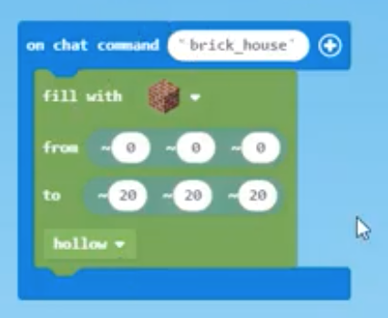

### Світові координати

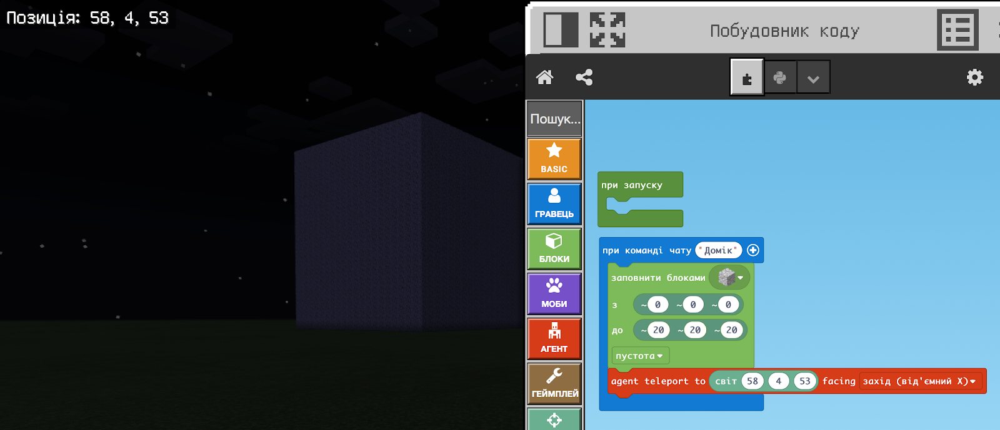

### Телепортуємо героя в певну точку світу

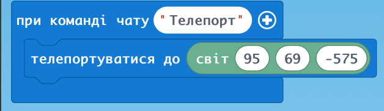

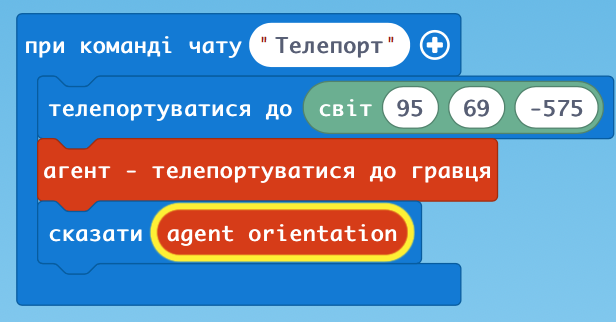

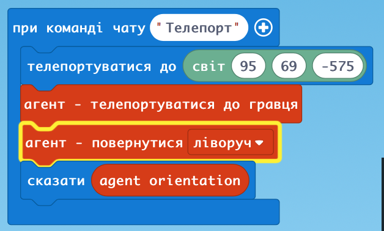

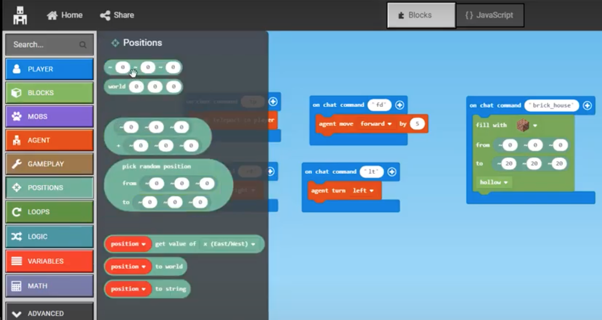

### Акваріум

Створимо основу для акваріуму

Заповнимо водою

Якщо пошкодились стінки акваріуму - виправити

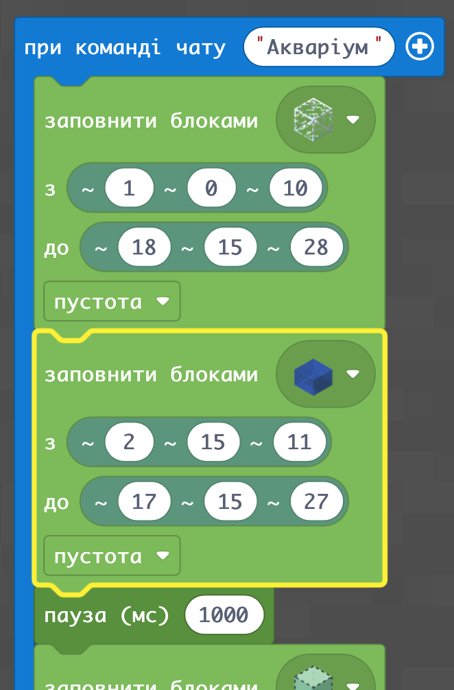

### Відкриваємо верх акваріуму

Додаємо водорості та корали

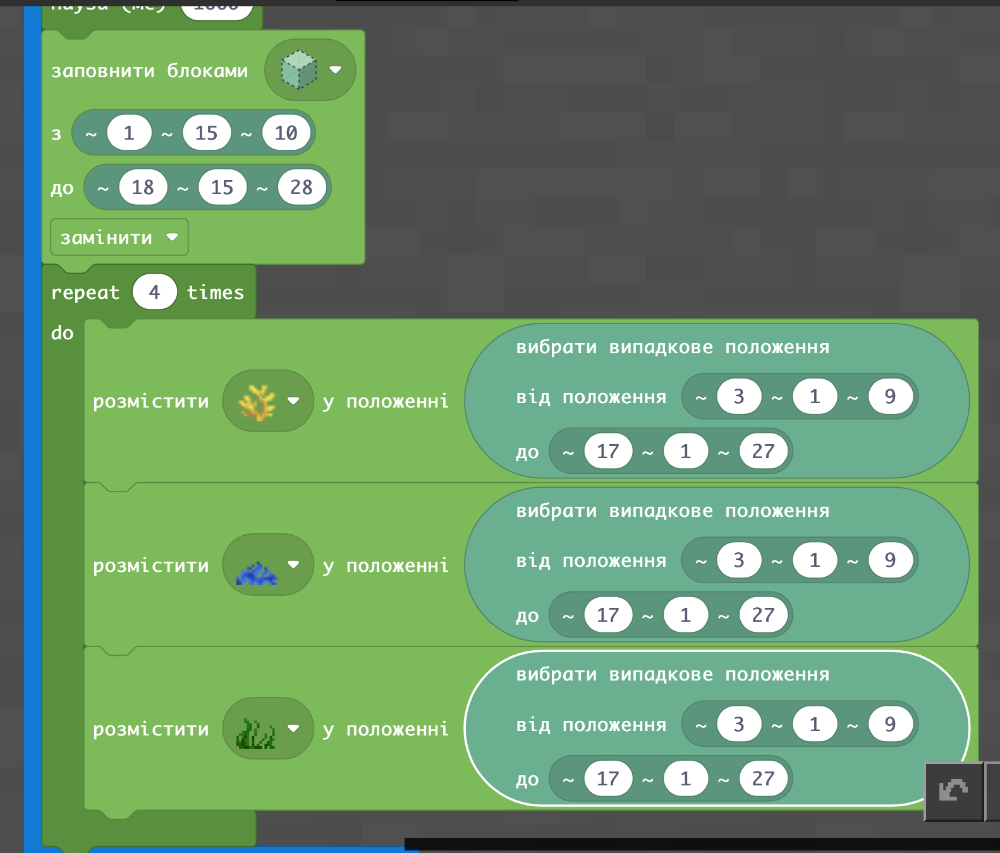

### Завдання:

У спільному світі усім одночасно телепортуватися в одне місце та кожному герою через код виконати побудову приватного будинку - таким чином виконається побудова селища

Також можна біля свого будинку розмістити невеликий басейн для плавання

